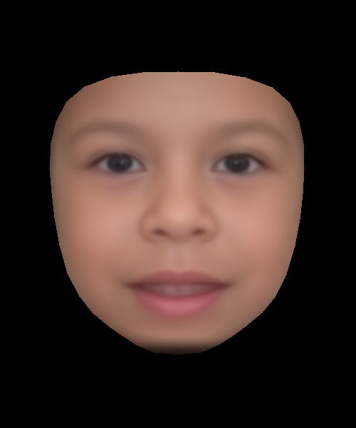
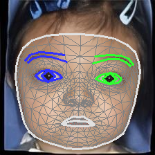
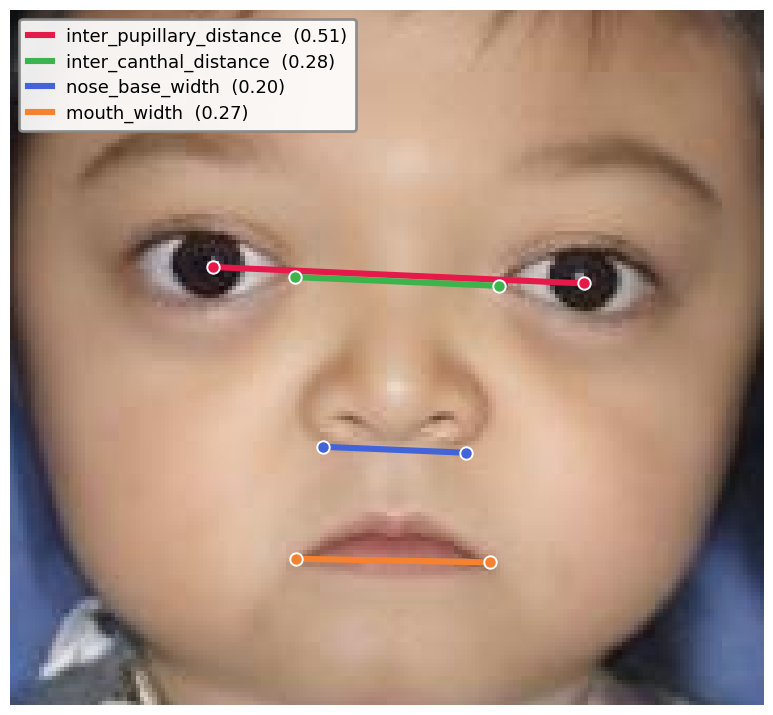

# FaceKit

Rare-disease facial phenotype analysis toolkit.

FaceKit takes face images of patients with rare genetic syndromes and produces:

1. **MediaPipe landmarks** (478 3D points, optional blendshapes / head pose).
2. **Average face** images per cohort.
3. **Geometric phenotype features** (~125 columns derived from the landmarks)
   suitable for downstream classification or HPO-aligned reporting.

It is designed to operate either on a directory tree of images
(`images/<cohort>/*.jpg`) or on a pre-computed JSONL of landmarks.

## Installation

```bash
pip install -e .[all]       # everything (landmarks + features + average face)
pip install -e .[morph]     # only landmarks + average face
pip install -e .[geometric] # only geometric features
```

Python ≥ 3.10. The geometric module depends on
[MediaPipe](https://github.com/google/mediapipe) and
[oaklib](https://github.com/INCATools/ontology-access-kit) for HPO/MONDO
resolution.

## CLI

A single `facekit` entry point exposes all commands:

| Command | What it does |
| --- | --- |
| `facekit extract-landmarks` | Run MediaPipe over an image folder; write JSON or JSONL landmarks (optionally with blendshapes, pose, mesh viz). |
| `facekit average-face` | Generate a per-cohort average face image. |
| `facekit extract-features` | Compute the full ~125-column geometric phenotype CSV from images or a landmark JSONL. Supports `--mode disease-specific` and `--frontal-check`. |
| `facekit extract-features-custom` | Same extractor, but driven by a user JSON that maps cohort folder names to a chosen subset of feature groups (no MONDO needed). Optionally loads a user Python file with extra `@register_feature` formulas. |
| `facekit resolve-diseases` | Helper that resolves disease names to MONDO IDs and caches the results. |
| 🚧 HPO prediction | _Coming soon_ — predict per-patient HPO phenotype terms directly from the geometric features. |
| 🚧 Privacy evaluation | _Coming soon_ — quantify the re-identification risk of the derived face representations. |

Run any command with `--help` for the full flag list.

## What each command does

> Example faces are derived from the [GestaltMatcher Database (GMDB)](https://db.gestaltmatcher.org) and are shown with consent.

One real example per command, produced by `scripts/make_figures.py`.

### `average-face`



Average face of the Williams syndrome cohort (GMDB).

### `extract-landmarks`



478-point MediaPipe mesh on an example face.

### `extract-features`



Four geometric measurements (IPD, inter-canthal, nasal base width, mouth width) drawn on the face.

### Quick start

```bash
# 1. Extract landmarks to a JSONL (cohort-aware: subfolders become cohorts)
facekit extract-landmarks -i images/ -o outputs/ --format jsonl --transform

# 2. Compute geometric features from that JSONL
facekit extract-features -i outputs/images_landmarks.jsonl -o results/

# 3. Average-face image per cohort
facekit average-face -i images/ -o results/
```

### Custom disease → feature mapping

`extract-features-custom` takes a JSON of the form:

```json
{
  "by_disease": {
    "22q11.2 deletion syndrome": {
      "feature_groups": ["EYE_FISSURE_SLANT", "NOSE_TIP_SHAPE", "PHILTRUM_LENGTH"]
    }
  }
}
```

See `custom_mapping.json` for a working example.

User-defined feature formulas can be registered at import time:

```python
# my_features.py
from facekit.api import register_feature

@register_feature(
    group="MY_NEW_GROUP",
    csv_columns=["my_metric"],
    hpo_terms=[("HP:0001234", "Example phenotype")],
)
def my_metric(lm, scales):
    return {"my_metric": float(lm[0, 0])}
```

```bash
facekit extract-features-custom \
    -i images/ -o results/ \
    --user-mapping custom_mapping.json \
    --user-features my_features.py
```

Plugins are sandboxed against the base 125 columns and the HPO direction
codes; collisions raise at registration time.

## Roadmap

Two capabilities are in development and not yet available:

- 🚧 **HPO prediction** — predict per-patient [HPO](https://hpo.jax.org/) phenotype
  terms directly from the extracted geometric features, turning the 125-column
  representation into a ranked list of candidate facial phenotypes.
- 🚧 **Privacy evaluation** — quantify how much identity information survives in the
  derived face representations, to support safe sharing of FaceKit outputs.

## Project layout

```
src/facekit/
├── cli.py                # typer entry point
├── api.py                # public plugin registry
├── commands/             # one CLI command per file
└── core/
    ├── morph/            # landmarks, alignment, averaging, warping
    └── geometric/        # 125-column extractor + batch drivers
scripts/
└── download_mondo.sh     # pin a dated mondo.obo for HPO/MONDO lookups
tests/                    # pytest suite
```

## License

MIT. See `LICENSE`.
